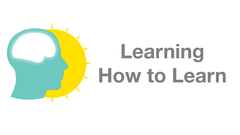
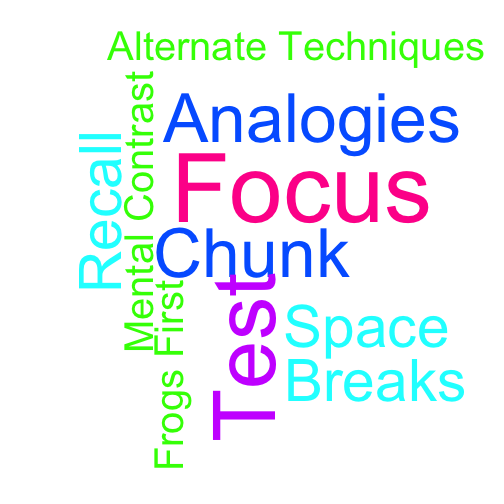
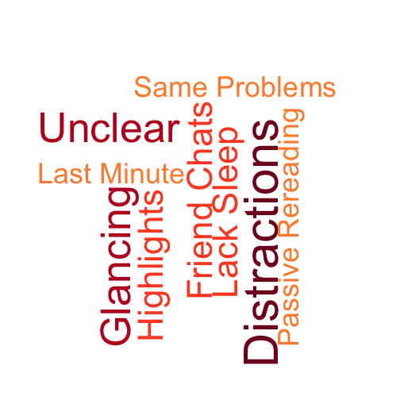

Learning How to Learn
========================================================
transition: rotate
Powerful mental tools to help you master tough subjects

UC San Diego - Coursera

<small> 
https://class.coursera.org/learning-001
</small>

10 Rules of Good Studying
========================================================

 

Ten Rules of Good Studying
========================================================
1. Use recall
- Test yourself
- Chunk your problems
- Space your repetition
- Alternate different problem-solving techniques during your practice
- Take breaks
- Use explanatory questioning and simple analogies
- Focus
- Eat your frogs first
- Make a mental contrast

Ten Rules of Bad Studying
========================================================

 

Ten Rules of Bad Studying
========================================================
1. Passive rereading
- Letting highlights overwhelm you
- Merely glancing at a problem’s solution and thinking you know how to do it
- Waiting until the last minute to study
- Repeatedly solving problems of the same type that you already know how to solve
- Letting study sessions with friends turn into chat sessions
- Neglecting to read the textbook before you start working problems
- Not checking with your instructors or classmates to clear up points of confusion
- Thinking you can learn deeply when you are being constantly distracted
- Not getting enough sleep

Learning How to Learn
========================================================
Powerful mental tools to help you master tough subjects

<small> 
https://class.coursera.org/learning-001
</small>

